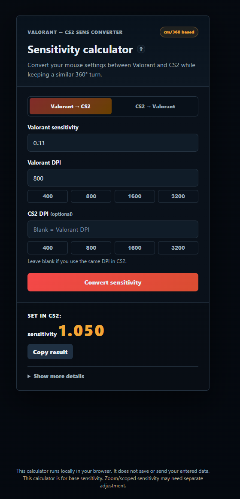

# Valorant ↔ CS2 Sens Converter

A lightweight sensitivity converter for Valorant and Counter-Strike 2.

I built this after struggling to recreate the same mouse feel across both games on a new PC. Since Valorant and CS2 calculate mouse movement differently, matching sensitivity manually can be frustrating. This tool uses each game's yaw value to estimate a matching sensitivity and help players keep a similar cm/360.

## Live Demo

<<<<<<< HEAD
Add your deployed link here:

```text
https://valorant-cs2-sens-converter.pages.dev


```

## Screenshot

Add a screenshot after deployment:

```text
zdj1.png
```
=======
https://arturrzufik.github.io/valorant-cs2-sens-converter/

## Screenshot


>>>>>>> 943434f (Add project screenshot)

## Features

- Convert sensitivity from Valorant to CS2
- Convert sensitivity from CS2 to Valorant
- Optional target DPI, defaults to source DPI
- eDPI comparison for source and target games
- Estimated cm/360 for both games
- Quick DPI presets: 400, 800, 1600, 3200
- Copy converted sensitivity to clipboard
- Runs fully in the browser, no backend and no data tracking

## How It Works

The calculator uses yaw values, which describe how each game converts mouse movement into camera rotation.

```text
target sensitivity = (source sensitivity × source DPI × source yaw) / (target DPI × target yaw)
```

Yaw values used:

```text
Valorant yaw = 0.07
CS2 yaw = 0.022
```

It also estimates cm/360:

```text
cm/360 = 360 / (sensitivity × DPI × yaw) × 2.54
```

## Tech Stack

- HTML
- CSS
- JavaScript
- No external libraries

## What I Learned

- Building a small but useful browser tool
- Handling form validation and user-friendly error states
- Converting game sensitivity using yaw values
- Improving UX with presets, copy-to-clipboard, and explanatory microcopy
- Preparing a static project for deployment and portfolio use

## Privacy

The calculator works locally in the browser. It does not save or send entered sensitivity or DPI values anywhere.

## Note

This calculator is for base sensitivity. Zoom/scoped sensitivity may need separate adjustment.
